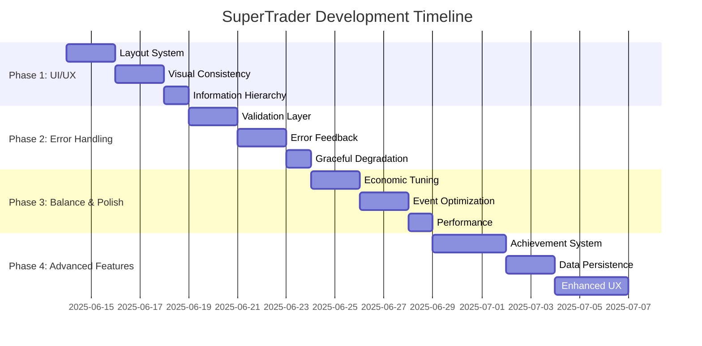

# Development Roadmap

## Project Overview
SuperTrader is a complete trading simulation game with solid core mechanics. The roadmap focuses on three key areas: UI/UX improvements, error handling, and strategic enhancements.

## Phase 1: UI/UX Overhaul (Week 1) ✅ COMPLETED
**Goal**: Create a responsive, visually consistent interface

### Day 1-2: Layout System ✅ COMPLETED
- [x] **Container Architecture**: Replaced absolute positioning with LayoutUtils class
- [x] **Responsive Grid**: Implemented percentage-based positioning system
- [x] **Screen Adaptation**: UI scales properly across resolutions (320x320 to 1024x1024)

### Day 3-4: Visual Consistency ✅ COMPLETED
- [x] **Typography System**: Standardized font sizes with responsive scaling
- [x] **Color Scheme**: Implemented consistent green/red/white color palette
- [x] **Spacing Standards**: Defined consistent positioning through LayoutUtils

### Day 5: Information Hierarchy ✅ COMPLETED
- [x] **Primary Info**: Price prominently displayed with large font
- [x] **Secondary Info**: Money/assets with medium font, trade details with small font
- [x] **Visual Grouping**: Related information positioned logically

**Deliverables**: ✅ ALL COMPLETED
- ✅ Responsive UI that works on all target resolutions
- ✅ Consistent visual design language
- ✅ Improved information readability

## Phase 2: Error Handling System (Week 2)
**Goal**: Robust validation and user-friendly error feedback

### Day 1-2: Validation Layer
- [ ] **Trade Validation**: Pre-execution checks for sufficient funds/assets
- [ ] **Input Sanitization**: Validate all user inputs and edge cases
- [ ] **State Validation**: Ensure game state consistency

### Day 3-4: Error Feedback System
- [ ] **UI Error Messages**: Replace console logs with user-visible feedback
- [ ] **Error Categories**: Different styling for warnings vs critical errors
- [ ] **Recovery Actions**: Suggest next steps when errors occur

### Day 5: Graceful Degradation
- [ ] **Audio Fallbacks**: Handle audio loading failures gracefully
- [ ] **Asset Fallbacks**: Backup plans for missing assets
- [ ] **Network Resilience**: Handle connectivity issues

**Deliverables**:
- Centralized error handling utility
- User-friendly error messaging system
- Robust fallback mechanisms

## Phase 3: Game Balance & Polish (Week 3)
**Goal**: Optimize economic parameters and gameplay flow

### Day 1-2: Economic Tuning
- [ ] **Inflation Balance**: Optimize inflation rates for engaging gameplay
- [ ] **Power-up Balance**: Adjust modifiers for fair but impactful effects
- [ ] **Black Swan Balance**: Ensure negative events are challenging but not punishing

### Day 3-4: Event System Optimization
- [ ] **Timer Optimization**: Prevent simultaneous events, optimize pacing
- [ ] **Event Variety**: Ensure good distribution of different event types
- [ ] **Progressive Difficulty**: Scale challenge based on player performance

### Day 5: Performance Optimization
- [ ] **Sprite Pooling**: Implement object reuse for event windows
- [ ] **Audio Management**: Optimize audio loading and playback
- [ ] **Memory Management**: Reduce garbage collection impact

**Deliverables**:
- Balanced economic parameters
- Optimized event timing and variety
- Improved performance metrics

## Phase 4: Advanced Features (Week 4+)
**Goal**: Add engagement and retention features

### Achievement System
- [ ] **Trade Milestones**: Rewards for trade counts, profit targets
- [ ] **Survival Achievements**: Time-based accomplishments
- [ ] **Event Achievements**: Special rewards for handling events well

### Data Persistence
- [ ] **Local Storage**: Save high scores and player progress
- [ ] **Statistics Tracking**: Detailed performance analytics
- [ ] **Player Profiles**: Multiple player support

### Enhanced UX
- [ ] **Tutorial System**: Guided first-time experience
- [ ] **Accessibility**: Keyboard navigation, screen reader support
- [ ] **Mobile Optimization**: Touch-friendly controls

## Technical Debt & Code Quality

### Immediate Improvements
- [ ] **Code Organization**: Extract utility functions and constants
- [ ] **Documentation**: Add JSDoc comments to all functions
- [ ] **Type Safety**: Consider TypeScript migration for better development experience

### Architecture Enhancements
- [ ] **State Management**: Centralized game state management
- [ ] **Event System**: Expand EventsCenter with more sophisticated patterns
- [ ] **Asset Pipeline**: Optimize loading and caching strategies

## Testing Strategy

### Manual Testing
- [ ] **Cross-browser**: Chrome, Firefox, Edge, Safari
- [ ] **Resolution Testing**: All supported screen sizes
- [ ] **Performance Testing**: Frame rate monitoring
- [ ] **Audio Testing**: Various audio configurations

### Automated Testing
- [ ] **Unit Tests**: Core game logic functions
- [ ] **Integration Tests**: Scene transitions and event handling
- [ ] **Performance Tests**: Memory usage and frame rate benchmarks

## Deployment & Distribution

### Build Optimization
- [ ] **Asset Compression**: Optimize images and audio files
- [ ] **Bundle Analysis**: Minimize JavaScript bundle size
- [ ] **CDN Strategy**: Separate assets for faster loading

### Platform Targets
- [ ] **Web Deployment**: GitHub Pages, Netlify, Vercel
- [ ] **Mobile Web**: PWA capabilities for mobile browsers
- [ ] **Desktop**: Electron wrapper for desktop distribution

## Success Metrics

### Technical Metrics
- **Performance**: Maintain 60fps on target devices
- **Load Time**: <3 seconds initial load
- **Bundle Size**: <5MB total assets
- **Error Rate**: <1% of user sessions encounter errors

### User Experience Metrics
- **Session Length**: Target 10+ minutes average
- **Completion Rate**: >80% of players complete at least 5 trades
- **Replay Rate**: >50% of players start a second game
- **User Feedback**: Positive reception on usability

## Risk Mitigation

### Technical Risks
- **Browser Compatibility**: Extensive cross-browser testing
- **Performance Issues**: Regular profiling and optimization
- **Audio Problems**: Robust fallback systems

### Design Risks
- **Complexity Creep**: Maintain focus on core gameplay
- **Balance Issues**: Iterative testing and adjustment
- **User Confusion**: Clear UI and feedback systems

## Timeline Summary

This roadmap provides a structured approach to improving SuperTrader while maintaining its core appeal and functionality.
