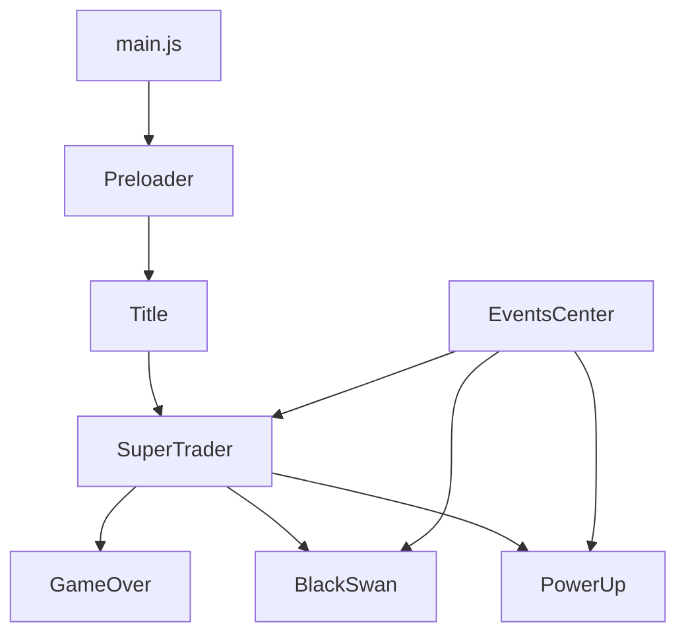

# System Patterns

## Architecture Overview
SuperTrader follows a scene-based architecture with event-driven communication:



## Key Technical Decisions

### Scene Management
- **Pattern**: State Machine
- **Implementation**: Phaser's built-in scene system
- **Flow**: Linear progression with modal overlays for events
- **Data Passing**: Scene initialization with data objects

### Event System
- **Pattern**: Observer/Mediator
- **Implementation**: EventsCenter singleton
- **Purpose**: Decoupled communication between scenes
- **Events**: 
  - `powerUpActivated`: Triggers positive market effects
  - `blackSwanActivated`: Triggers negative market effects
  - `userData`: Passes player state to event scenes

### Game State Management
- **Pattern**: Centralized State
- **Location**: SuperTrader scene
- **Components**:
  - `activeUser`: Player statistics and status
  - `globalSettings`: Game modifiers and configuration
  - `globalTimers`: Event timing management
  - `allTrades`: Trade history tracking

### Price Generation Algorithm
```javascript
// Punishing downward-biased system:
1. priceRandomMaker() - Downward-biased price bounds
2. priceMaker() - Permanent decline with liquidity traps
3. Mental health deterioration tied to inflation
4. No bull markets - only temporary liquidity traps
```

## Component Relationships

### Core Systems
1. **Economy Engine**
   - Price fluctuation algorithm
   - Inflation calculation
   - Market season management (bull/bear/crab)

2. **Trade System**
   - Position management (long/short/sideline)
   - Entry/exit price tracking
   - Profit/loss calculation

3. **Event System**
   - Timer-based random events
   - Modifier application
   - UI overlay management

4. **UI Controller**
   - Real-time data display
   - Input handling
   - Visual feedback

### Design Patterns in Use
- **Singleton**: EventsCenter, game configuration
- **Observer**: Event listeners for market changes
- **State**: Trade position states
- **Factory**: PowerUp and BlackSwan creation
- **Command**: Trade execution actions

## Critical Implementation Paths
1. **Game Initialization**: Preloader → Title → SuperTrader
2. **Trade Execution**: Button click → validation → state update → UI refresh
3. **Event Triggering**: Timer threshold → scene overlay → modifier application
4. **Game Over**: Condition check → scene transition → score display

## Error Handling Patterns
- **Current**: Basic console logging and sound feedback
- **Needed**: Centralized error handling with user feedback
- **Pattern**: Try-catch blocks with graceful degradation
